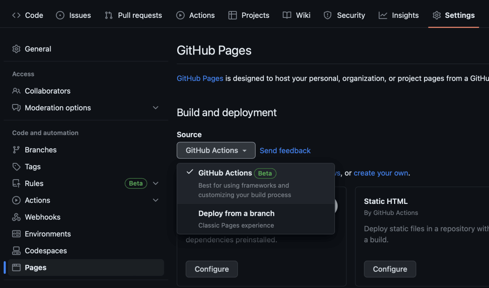

# 静的ページの立ち上げ
1. Githubのリポジトリを作成
2. Reactのプロジェクトを作る
```shell
npx create-react-app {プロジェクト名}
```
```shell
cd {プロジェクト名}
npm start
```
でURLがhttp://localhost:3000/ のプロジェクトが実行される

3. ローカルのプロジェクトをGithubと連携する

# 初めにしようとしたこと(失敗)
- `gh-pages` でデプロイしようとした

### 参考記事
- **今日のHello World「React と GitHub Pagesを使って、静的ページを立ち上げるまで。」**<br>
https://nikeeshipro.hatenablog.com/entry/2019/03/21/212156

```shell
npm run deploy
```
- でリポジトリに`gh-pages`というブランチを作り、そこに静的ページがデプロイされる。
- がなかなか上手くいかず、いろいろな記事を見た結果、`Github Actions`を使ってデプロイした方が簡単そうだった。

# Github Actionsを使ったデプロイ
- 今回はこの方法を使った。

### 参考記事
- **GitHub ActionsでReactアプリをGitHub Pagesにデプロイする**<br>
https://zenn.dev/acha_n/articles/deploy-react-app-with-github-actions

### ワークフローを作成
まずは GitHub のリポジトリを選択し、「Settings」タブ >「Pages」>「Build and deployment」下の「Source」で「GitHub Actions」を選択します。



次にワークフローを作成します。プロジェクトのルートに`.github`というディレクトリを作成し、その中に`workflows`というディレクトリを作成します。次に「workflows」の中に .ymlファイルを作成します。`.yml` ファイルの名前は何でも OK です。
### deploy-gh-pages.yml
```yml:deploy-gh-pages.yml
name: Deploy GitHub Pages #workflow-name

on:
  push:
    branches: ['main']

  workflow_dispatch:

permissions:
  contents: read
  pages: write
  id-token: write

concurrency:
  group: 'pages'
  cancel-in-progress: true

jobs:
  build:
    environment:
      name: github-pages
      url: ${{ steps.deployment.outputs.page_url }}
    runs-on: ubuntu-latest
    steps:
      - name: Checkout
        uses: actions/checkout@v4
      - name: Setup Pages
        uses: actions/configure-pages@v4
      - name: Setup Node
        uses: actions/setup-node@v4
        with:
          node-version: 20 #node-version
      - name: Install dependencies
        run: npm install
      - name: Build
        run: npm ci && npm run build
        env:
          PUBLIC_URL: /Portfolio-Blog #repository-name
          CI: false #warning -> error
      - name: Upload artifact
        uses: actions/upload-pages-artifact@v2
        with:
          path: './build' #npm run build : create-react-app -> ./build

  deploy:
    environment:
      name: github-pages
      url: ${{ steps.deployment.outputs.page_url }}
    runs-on: ubuntu-latest
    needs: build
    steps:
      - name: Deploy to GitHub Pages
        id: deployment
        uses: actions/deploy-pages@v2
```

### ワークフローの実行
ワークフローが完成したら commit して push します。その後デフォルトブランチに merge すると、自動的にワークフローが実行されます。

「Actions」タブの`All workflows`下に実行中および実行済みのワークフローが一覧で表示されます。成功すると緑色のチェックマークが付きます。

### 注意点
- 開発を進めていくとwarningがたくさん出てエラーが起きたので無視するようにした。
- ~~warningの解決は後回しにした...~~ 

```yml
CI: false #warning -> error
```

- これでうまく静的ページを立ち上げることができた。