# Monster-Hunter-Now
# 竜玉のかけら
| モンスター | 部位破壊箇所 |  |
| :----: | :----: | ---- |
| **ドスジャグラス**| **前脚：まえあし** | 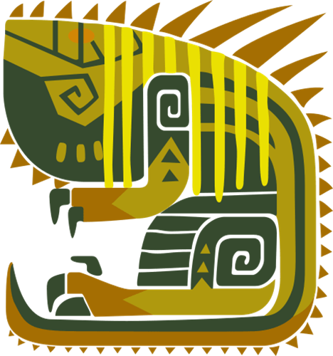 |
|  |  |  |
| **レイギエナ** | **翼：つばさ** | |
|  |  |  |
| **ディアブロス** | **角：つの** | 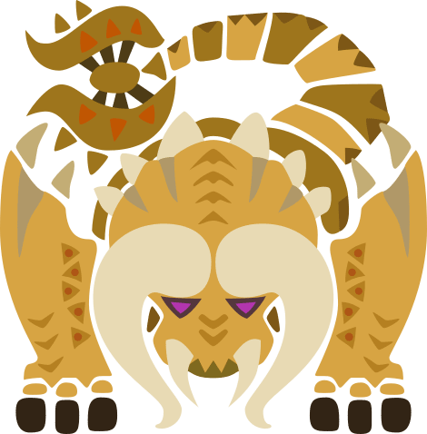 |
| **バフバロ** | **角：つの** | 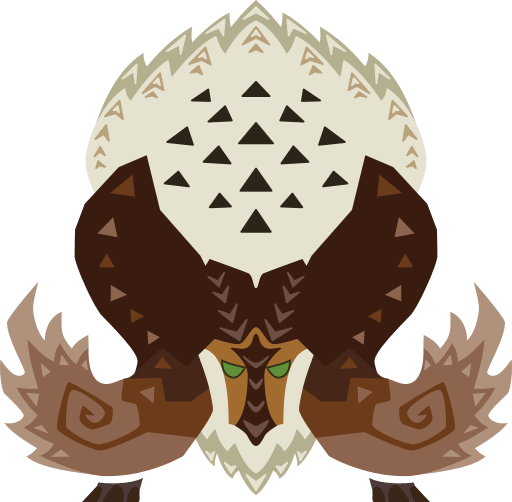 |
|  |  |  |
| **クルルヤック**| **頭：あたま** | 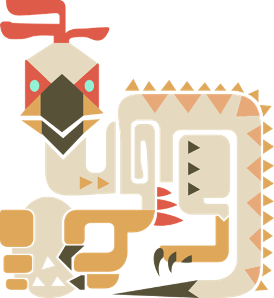 |
| **ドスギルオス** | **頭：あたま** | 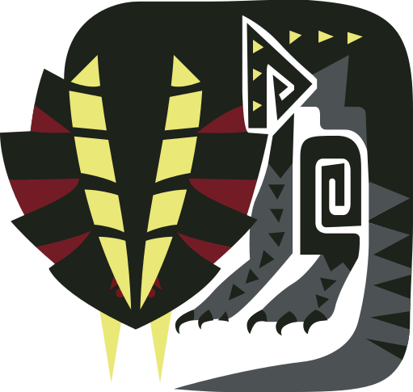|
| **ジュラトドス** | **頭：あたま** | 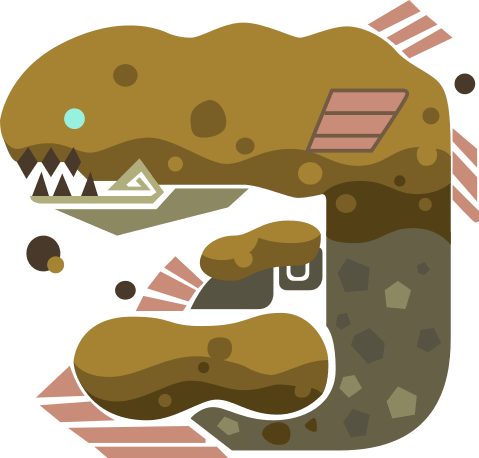 |
| **ラドバルキン** | **頭：あたま** | 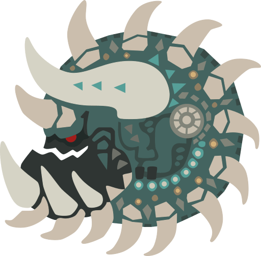 |
|  |  |  |
| **プケプケ** | **尻尾：しっぽ** | 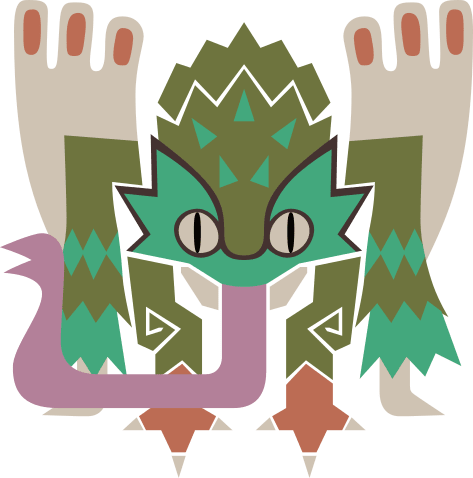 |
| **ボルボロス** | **尻尾：しっぽ** | 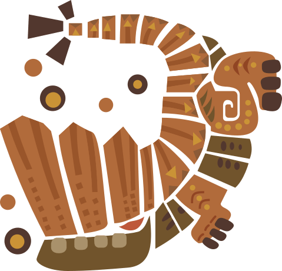 |
| **トビガカチ** | **尻尾：しっぽ** | 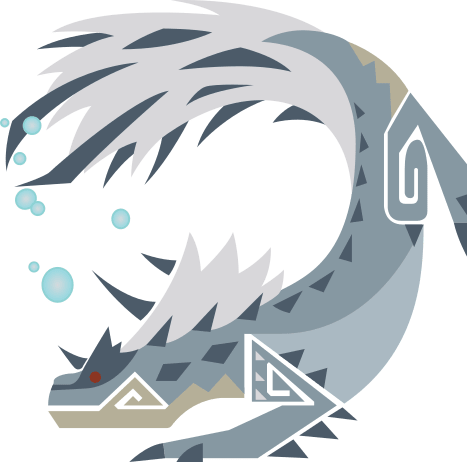 |
| **パウルム** | **尻尾：しっぽ** |  |
| **アンジャナフ** | **尻尾：しっぽ** |  |
| **リオレイア** | **尻尾：しっぽ** | 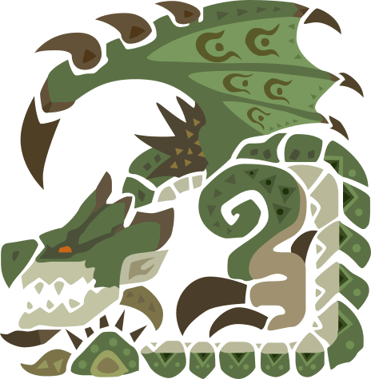 |
| **リオレウス** | **尻尾：しっぽ** | 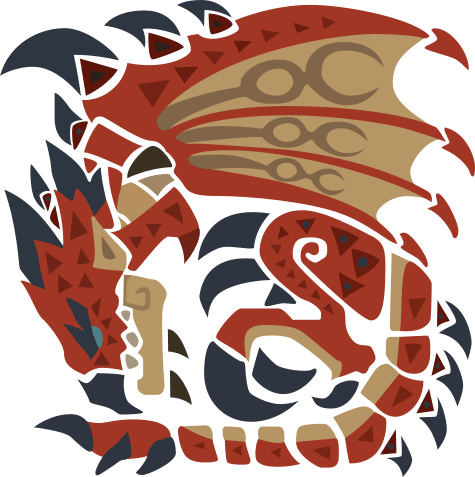 |
| **ベリオロス** | **尻尾：しっぽ** | 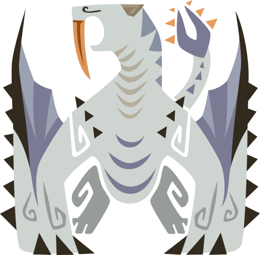 |
| **ジンオウガ** | **尻尾：しっぽ** | 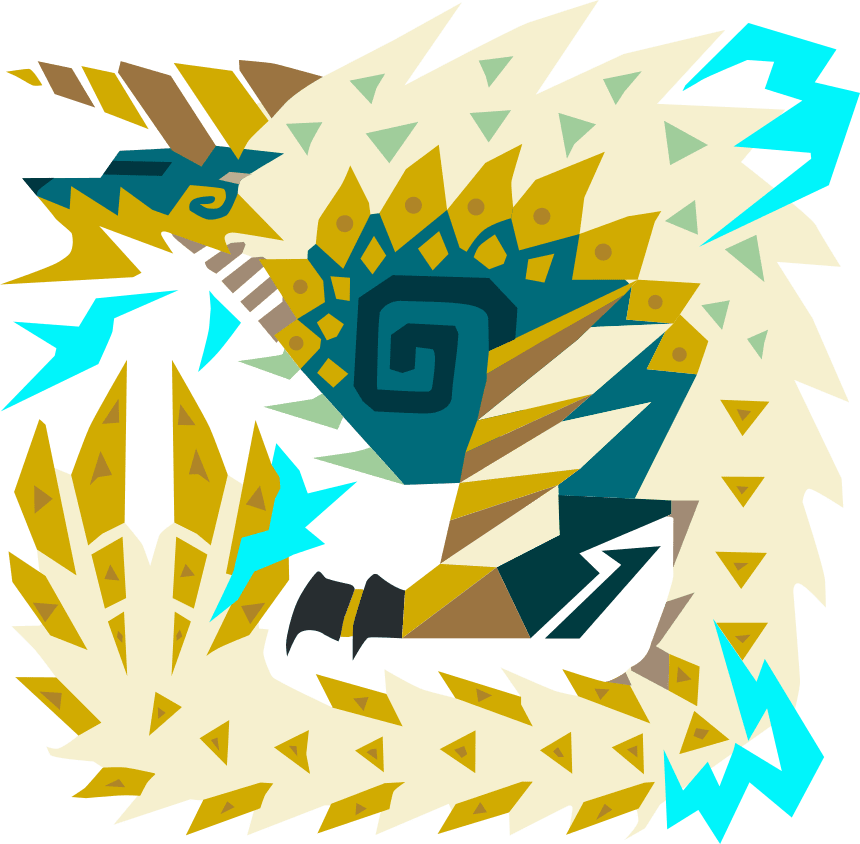 |
| --------------------------------- | ----------------------------- |  |

# 各モンスターの素材報酬
|  | ★2 | ★3 | ★4 | ★5 | ★6 |
| :----: | :----: | :----: | :----: | :----: | :----: |
| **頭：あたま** 　| | 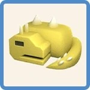  | |  | |
| **前脚：まえあし** | 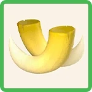 | | 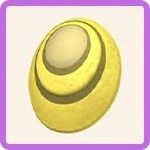 | |  |

|  | ★2 | ★3 | ★4 | ★5 | ★6 |
| :----: | :----: | :----: | :----: | :----: | :----: |
| **頭：あたま** 　|  | | 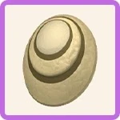 | |  |
| **前脚：まえあし** | | 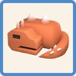 | | 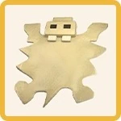 | |

|  | ★2 | ★3 | ★4 | ★5 | ★6 |
| :----: | :----: | :----: | :----: | :----: | :----: |
| **頭：あたま** 　| | | | | |
| **前脚：まえあし** | | | | | |

