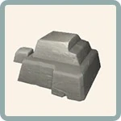

# Monster-Hunter-Now
# 竜玉のかけら
| モンスター | 部位破壊箇所 |  |
| :----: | :----: | ---- |
| **ドスジャグラス**| **前脚：まえあし** |  |
|  |  |  |
| **レイギエナ** | **翼：つばさ** | |
|  |  |  |
| **ディアブロス** | **角：つの** |  |
| **バフバロ** | **角：つの** |  |
|  |  |  |
| **クルルヤック**| **頭：あたま** |  |
| **ドスギルオス** | **頭：あたま** | |
| **ジュラトドス** | **頭：あたま** |  |
| **ラドバルキン** | **頭：あたま** |  |
|  |  |  |
| **プケプケ** | **尻尾：しっぽ** |  |
| **ボルボロス** | **尻尾：しっぽ** |  |
| **トビガカチ** | **尻尾：しっぽ** |  |
| **パウルム** | **尻尾：しっぽ** |  |
| **アンジャナフ** | **尻尾：しっぽ** |  |
| **リオレイア** | **尻尾：しっぽ** |  |
| **リオレウス** | **尻尾：しっぽ** |  |
| **ベリオロス** | **尻尾：しっぽ** |  |
| **ジンオウガ** | **尻尾：しっぽ** |  |
| --------------------------------- | ----------------------------- |  |

# 各モンスターの素材報酬
|  | 破壊 | ★2 | ★3 | ★4 | ★5 | ★6 |
| :----: | :----: | :----: | :----: | :----: | :----: | :----: |
| **頭：あたま** |  | |   | |  | |
| **前脚：まえあし** |  |  | |  | |  |

|  | 破壊 | ★2 | ★3 | ★4 | ★5 | ★6 |
| :----: | :----: | :----: | :----: | :----: | :----: | :----: |
| **頭：あたま** |  |  | |  | |  |
| **前脚：まえあし** |  | |  | |  | |

|  | 破壊 | ★2 | ★3 | ★4 | ★5 | ★6 |
| :----: | :----: | :----: | :----: | :----: | :----: | :----: |
| **頭：あたま** 　|  | |  | |  | |
| **翼：つばさ** |  | | |  | | |
| **尻尾：しっぽ** |  |  | | | |  |

|  | 破壊 | ★2 | ★3 | ★4 | ★5 | ★6 |
| :----: | :----: | :----: | :----: | :----: | :----: | :----: |
| **頭：あたま** |  | |  |  | | |
| **前脚：まえあし** |  | | | |  | |
| **尻尾：しっぽ** |  |  | | | |  |

|  | 破壊 | ★2 | ★3 | ★4 | ★5 | ★6 |
| :----: | :----: | :----: | :----: | :----: | :----: | :----: |
| **頭：あたま** |  | |  | |  |  |
| **前脚：まえあし** |  | | |  | | |
| **尻尾：しっぽ** |  |  | | | | |

|  | 破壊 | ★2 | ★3 | ★4 | ★5 | ★6 |
| :----: | :----: | :----: | :----: | :----: | :----: | :----: |
| **頭：あたま** |  |  | | | | |
| **前脚：まえあし** |  | |  |  | | |
| **尻尾：しっぽ** |  | | | |  |  |

|  | 破壊 | ★2 | ★3 | ★4 | ★5 | ★6 |
| :----: | :----: | :----: | :----: | :----: | :----: | :----: |
| **翼：つばさ** |  |  | |  | | |
| **尻尾：しっぽ** |  | |  | |  |  |

|  | 破壊 | ★2 | ★3 | ★4 | ★5 | ★6 |
| :----: | :----: | :----: | :----: | :----: | :----: | :----: |
| **頭：あたま** |  |  | | | |  |
| **胴：どう** |  | |  |  | | |
| **尻尾：しっぽ** |  | | | |  | |

|  | 破壊 | ★2 | ★3 | ★4 | ★5 | ★6 |
| :----: | :----: | :----: | :----: | :----: | :----: | :----: |
| **頭：あたま** |  | |  | | | |
| **後脚：うしろあし** |  | | |  | | |
| **尻尾：しっぽ** |  |  | | |  |  |

|  | 破壊 | ★2 | ★3 | ★4 | ★5 | ★6 |
| :----: | :----: | :----: | :----: | :----: | :----: | :----: |
| **頭：あたま** |  | | |  | | |
| **翼：つばさ** |  |  | | | | |
| **尻尾：しっぽ** |  | |  | |  |  |

|  | 破壊 | ★2 | ★3 | ★4 | ★5 | ★6 |
| :----: | :----: | :----: | :----: | :----: | :----: | :----: |
| **翼：つばさ** |  |  |  |  | |  |
| **尻尾：しっぽ** |  | | | |  | |

|  | 破壊 | ★2 | ★3 | ★4 | ★5 | ★6 |
| :----: | :----: | :----: | :----: | :----: | :----: | :----: |
| **角：つの** |  | | | | |  |
| **背中：せなか** |  | |  |  |  | |
| **尻尾：しっぽ** |  |  | | |  | |

|  | 破壊 | ★2 | ★3 | ★4 | ★5 | ★6 |
| :----: | :----: | :----: | :----: | :----: | :----: | :----: |
| **頭：あたま** |  | | |  | | |
| **背中：せなか** |  | |  | | | |
| **尻尾：しっぽ** |  |  |  | |  |  | 破壊 |

|  | 破壊 | ★2 | ★3 | ★4 | ★5 | ★6 |
| :----: | :----: | :----: | :----: | :----: | :----: | :----: |
| **頭：あたま** |  | |  | | |  |
| **胴：どう** |  | | | |  | |
| **後脚：うしろあし** |  | | |  | | |
| **尻尾：しっぽ** |  |  | | | | |

|  | 破壊 | ★2 | ★3 | ★4 | ★5 | ★6 |
| :----: | :----: | :----: | :----: | :----: | :----: | :----: |
| **角：つの** |  | | | |  |  |
| **後脚：うしろあし** |  | | |  | | |
| **尻尾：しっぽ** |  |  |  | | | |

|  | 破壊 | ★2 | ★3 | ★4 | ★5 | ★6 |
| :----: | :----: | :----: | :----: | :----: | :----: | :----: |
| **頭：あたま** |  | | | |  | |
| **棘：とげ** |  | |  |  | | |
| **尻尾：しっぽ** |  |  | | | |  |

|  | 破壊 | ★2 | ★3 | ★4 | ★5 | ★6 |
| :----: | :----: | :----: | :----: | :----: | :----: | :----: |
| **角：つの** |  | | | |  | |
| **背中：せなか** |  | |  | | | |
| **前脚：まえあし** |  | | |  | | |
| **尻尾：しっぽ** |  |  | | | |  |

# 攻撃の種類
| | 攻撃の種類 | 片手剣 | 大剣 | ハンマー | 太刀 | ライトボウガン | 弓 | 双剣 | ランス |
| :----: | :----: | :----: | :----: | :----: | :----: | :----: | :----: | :----: | :----: |
|  | 破壊可能 | 〇 | 〇 | 〇 | 〇 | 〇 | 〇 |  〇 |〇 |
|  | 切断 | 〇 | 〇 | | 〇 | 斬裂弾 | SPスキル | | |
|  | 打撃 | 盾攻撃 | タックル | 〇 | | | | | |

# 現状武器

# 予定

# 必要素材
| **ジャナフ弓** | G7-5 | G8-2 |
| :----: | :----: | :----: |
|  | 竜骨(小) | 53 |
|  | とがった爪 | 64 |
|  | 南蛮竜の尻尾 | 40 |
|  | 南蛮竜の逆鱗 | 5 |
|  | 火竜の良質な鱗 | 4 |
|  | 竜玉のかけら | 4 |
|  | 武器精錬材 | 5 |
|  | ゼニー | 16000 |
|  | アンジャナフ★7 | 64 |

| **レイギエナ弓** | G7-3 | G8-2 |
| :----: | :----: | :----: |
|  | 鉄鉱石 | 95 |
|  | マカライト鉱石 | 30 |
|  | ドラグライト鉱石 | 11 |
|  | 大地の結晶 | 31 |
|  | とがった爪 | 115 |
|  | ゴム質の甲殻 | 6 |
|  | 浮空竜の良質な鱗 | 4|
|  | 風漂竜の鱗 | 48 |
|  | 風漂竜の尻尾 | 40 |
|  | 風漂竜の逆鱗 | 5 |
|  | 竜玉のかけら | 4 |
|  | 武器精錬材 | 5 |
|  | ゼニー | 25000 |
|  | レイギエナ★7 | 64 |

| **ガカチ太刀** | G7-1 | G8-2 |
| :----: | :----: | :----: |
|  | 竜骨(小) | 137 |
|  | 竜骨(虫) | 30 |
|  | 竜骨(大) | 11 |
|  | 上竜骨 | 31 |
|  | 雷光虫 | 31 |
|  | とがった爪 | 166 |
|  | 痺賊竜の尻尾 | 6 |
|  | 痺賊竜の頭巾殻 | 6 |
|  | 痺賊竜の良質な鱗 | 4 |
|  | 飛雷竜の爪 | 96 |
|  | 飛雷竜の尻尾 | 70 |
|  | 飛雷竜の皮膜 | 20 |
|  | 飛雷竜の電極針 | 5 |
|  | 竜玉のかけら | 4 |
|  | 武器精錬材 | 5 |
|  | ゼニー | 30000 |
|  | トビガカチ★7 | 112 |

| **ジュラ太刀** | G6-2 | G8-2 |
| :----: | :----: | :----: |
|  | 竜骨(小) | 169 |
|  | 竜骨(虫) | 50 |
|  | 竜骨(大) | 18 |
|  | 流水草 | 51 |
|  | セッチャクロアリ | 51 |
|  | とがった爪 | 210 |
|  | 賊竜の尻尾 | 6 |
|  | 賊竜の頭巾殻 | 10 |
|  | 賊竜の良質な鱗 | 4 |
|  | 泥魚竜の鱗 | 174 |
|  | 泥魚竜の牙 | 90 |
|  | 泥魚竜のヒレ | 35 |
|  | 泥魚竜の良質な鱗 | 12 |
|  | 泥魚竜の良質な甲殻 | 8 |
|  | 竜玉のかけら | 4 |
|  | 武器精錬材 | 8 |
|  | ゼニー | 42000 |
|  | ジュラトドス★7 | 144 |

# 合計
| **合計** | | | | |
| :----: | :----: | :----: | :----: | :----: |
|  | とがった爪 | 555 | 16 | **NO** |
|  | 竜骨(小) | 359 | 68 | **NO** |
|  | 竜骨(中) | 80 | 67 | **NO** |
|  | 竜骨(大) | 29 | 67 | ○ |
|  | 上竜骨 | 31 | 12 | **NO** |
|  | 鉄鉱石 | 95 | 183 | ○ |
|  | マカライト鉱石 | 30 | 121 | ○ |
|  | ドラグライト鉱石 | 11 | 79 | ○ |
|  | 大地の結晶 | 31 | 76 | ○ |
|  | 雷光虫 | 31 | 61 | ○ |
|  | 流水草 | 51 | 87 | ○ |
|  | セッチャクロアリ | 51 | 18 | **NO** |
|  | 賊竜の爪 | 6 | 23 | ○ |
|  | 賊竜のたてがみ | 10 | 18 | ○ |
|  | 賊竜の良質な鱗 | 4 | 11 | ○ |
|  | 痺賊竜の尻尾 | 6 | 17 | ○ |
|  | 痺賊竜の頭巾殻 | 6 | 30 | ○ |
|  | 痺賊竜の良質な鱗 | 4 | 11 | ○ |
|  | 飛雷竜の爪 | 96 | 12 | **NO** |
|  | 飛雷竜の尻尾 | 70 | 0 | **NO** |
|  | 飛雷竜の皮膜 | 20 | 16 | **NO** |
|  | 飛雷竜の電極針 | 5 | 15 | ○ |
|  | ゴム質の甲殻 | 6 | 22 | ○ |
|  | 浮空竜の良質な鱗 | 4 | 13 | ○ |
|  | 泥魚竜の鱗 | 174 | 53 | **NO** |
|  | 泥魚竜の牙 | 90 | 11 | **NO** |
|  | 泥魚竜のヒレ | 35 | 25 | **NO** |
|  | 泥魚竜の良質な鱗 | 12 | 8 | **NO** |
|  | 泥魚竜の良質な甲殻 | 8 | 4 | **NO** |
|  | 南蛮竜の尻尾 | 40 | 31 | **NO** |
|  | 南蛮竜の逆鱗 | 5 | 4 | **NO** |
|  | 風漂竜の鱗 | 48 | 7 | **NO** |
|  | 風漂竜の尻尾 | 40 | 7 | **NO** |
|  | 風漂竜の逆鱗 | 5 | 3 | **NO** |
|  | 火竜の良質な鱗 | 4 | 5 | ○ |
|  | 竜玉のかけら | 16 | 2 | **NO** |
|  | 武器精錬材 | 23 | 45 | ○ |
|  | ゼニー | 113000 | 9810 | **NO** |
