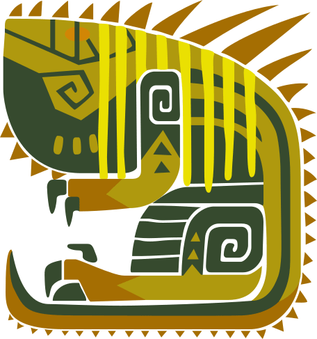

# Monster-Hunter-Now
# 竜玉のかけら
| モンスター | 部位破壊箇所 |  |
| :----: | :----: | ---- |
| **ドスジャグラス**| **前脚** |  |
|  |  |  |
| **レイギエナ** | **翼** | |
|  |  |  |
| **ディアブロス** | **角** |  |
| **バフバロ** | **角** |  |
|  |  |  |
| **クルルヤック**| **頭** |  |
| **ドスギルオス** | **頭** | |
| **ジュラトドス** | **頭** |  |
| **ラドバルキン** | **頭** |  |
|  |  |  |
| **プケプケ** | **尻尾** |  |
| **ボルボロス** | **尻尾** |  |
| **トビガカチ** | **尻尾** |  |
| **パウルム** | **尻尾** |  |
| **アンジャナフ** | **尻尾** |  |
| **リオレイア** | **尻尾** |  |
| **リオレウス** | **尻尾** |  |
| **ベリオロス** | **尻尾** |  |
| **ジンオウガ** | **尻尾** |  |
| --------------------------------- | ----------------------------- |  |
