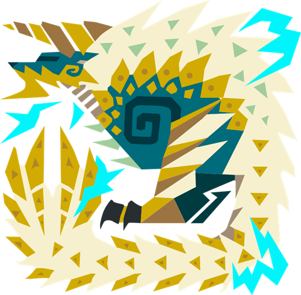

# Monster-Hunter-Now
# 竜玉のかけら
| モンスター | 部位破壊箇所 |  |
| :----: | :----: | ---- |
| **ドスジャグラス**| **前脚：まえあし** |  |
|  |  |  |
| **レイギエナ** | **翼：つばさ** | |
|  |  |  |
| **ディアブロス** | **角：つの** |  |
| **バフバロ** | **角：つの** |  |
|  |  |  |
| **クルルヤック**| **頭：あたま** |  |
| **ドスギルオス** | **頭：あたま** | |
| **ジュラトドス** | **頭：あたま** |  |
| **ラドバルキン** | **頭：あたま** |  |
|  |  |  |
| **プケプケ** | **尻尾：しっぽ** |  |
| **ボルボロス** | **尻尾：しっぽ** |  |
| **トビガカチ** | **尻尾：しっぽ** |  |
| **パウルム** | **尻尾：しっぽ** |  |
| **アンジャナフ** | **尻尾：しっぽ** |  |
| **リオレイア** | **尻尾：しっぽ** |  |
| **リオレウス** | **尻尾：しっぽ** |  |
| **ベリオロス** | **尻尾：しっぽ** |  |
| **ジンオウガ** | **尻尾：しっぽ** |  |
| --------------------------------- | ----------------------------- |  |

# 各モンスターの素材報酬
|  | 破壊 | ★2 | ★3 | ★4 | ★5 | ★6 |
| :----: | :----: | :----: | :----: | :----: | :----: | :----: |
| **頭：あたま** |  | |   | |  | |
| **前脚：まえあし** |  |  | |  | |  |

|  | 破壊 | ★2 | ★3 | ★4 | ★5 | ★6 |
| :----: | :----: | :----: | :----: | :----: | :----: | :----: |
| **頭：あたま** |  |  | |  | |  |
| **前脚：まえあし** |  | |  | |  | |

|  | 破壊 | ★2 | ★3 | ★4 | ★5 | ★6 |
| :----: | :----: | :----: | :----: | :----: | :----: | :----: |
| **頭：あたま** 　|  | |  | |  | |
| **翼：つばさ** |  | | |  | | |
| **尻尾：しっぽ** |  |  | | | |  |

|  | 破壊 | ★2 | ★3 | ★4 | ★5 | ★6 |
| :----: | :----: | :----: | :----: | :----: | :----: | :----: |
| **頭：あたま** |  | |  |  | | |
| **前脚：まえあし** |  | | | |  | |
| **尻尾：しっぽ** |  |  | | | |  |

|  | 破壊 | ★2 | ★3 | ★4 | ★5 | ★6 |
| :----: | :----: | :----: | :----: | :----: | :----: | :----: |
| **頭：あたま** |  | |  | |  |  |
| **前脚：まえあし** |  | | |  | | |
| **尻尾：しっぽ** |  |  | | | | |

|  | 破壊 | ★2 | ★3 | ★4 | ★5 | ★6 |
| :----: | :----: | :----: | :----: | :----: | :----: | :----: |
| **頭：あたま** |  |  | | | | |
| **前脚：まえあし** |  | |  |  | | |
| **尻尾：しっぽ** |  | | | |  |  |

|  | 破壊 | ★2 | ★3 | ★4 | ★5 | ★6 |
| :----: | :----: | :----: | :----: | :----: | :----: | :----: |
| **翼：つばさ** |  |  | |  | | |
| **尻尾：しっぽ** |  | |  | |  |  |

|  | 破壊 | ★2 | ★3 | ★4 | ★5 | ★6 |
| :----: | :----: | :----: | :----: | :----: | :----: | :----: |
| **頭：あたま** |  |  | | | |  |
| **胴：どう** |  | |  |  | | |
| **尻尾：しっぽ** |  | | | |  | |

|  | 破壊 | ★2 | ★3 | ★4 | ★5 | ★6 |
| :----: | :----: | :----: | :----: | :----: | :----: | :----: |
| **頭：あたま** |  | |  | | | |
| **後脚：うしろあし** |  | | |  | | |
| **尻尾：しっぽ** |  |  | | |  |  |

|  | 破壊 | ★2 | ★3 | ★4 | ★5 | ★6 |
| :----: | :----: | :----: | :----: | :----: | :----: | :----: |
| **頭：あたま** |  | | |  | | |
| **翼：つばさ** |  |  | | | | |
| **尻尾：しっぽ** |  | |  | |  |  |

|  | 破壊 | ★2 | ★3 | ★4 | ★5 | ★6 |
| :----: | :----: | :----: | :----: | :----: | :----: | :----: |
| **翼：つばさ** |  |  |  |  | |  |
| **尻尾：しっぽ** |  | | | |  | |

|  | 破壊 | ★2 | ★3 | ★4 | ★5 | ★6 |
| :----: | :----: | :----: | :----: | :----: | :----: | :----: |
| **角：つの** |  | | | | |  |
| **背中：せなか** |  | |  |  |  | |
| **尻尾：しっぽ** |  |  | | |  | |

|  | 破壊 | ★2 | ★3 | ★4 | ★5 | ★6 |
| :----: | :----: | :----: | :----: | :----: | :----: | :----: |
| **頭：あたま** |  | | |  | | |
| **背中：せなか** |  | |  | | | |
| **尻尾：しっぽ** |  |  |  | |  |  | 破壊 |

|  | 破壊 | ★2 | ★3 | ★4 | ★5 | ★6 |
| :----: | :----: | :----: | :----: | :----: | :----: | :----: |
| **頭：あたま** |  | |  | | |  |
| **胴：どう** |  | | | |  | |
| **後脚：うしろあし** |  | | |  | | |
| **尻尾：しっぽ** |  |  | | | | |

|  | 破壊 | ★2 | ★3 | ★4 | ★5 | ★6 |
| :----: | :----: | :----: | :----: | :----: | :----: | :----: |
| **角：つの** |  | | | |  |  |
| **後脚：うしろあし** |  | | |  | | |
| **尻尾：しっぽ** |  |  |  | | | |

|  | 破壊 | ★2 | ★3 | ★4 | ★5 | ★6 |
| :----: | :----: | :----: | :----: | :----: | :----: | :----: |
| **頭：あたま** |  | | | |  | |
| **棘：とげ** |  | |  |  | | |
| **尻尾：しっぽ** |  |  | | | |  |

|  | 破壊 | ★2 | ★3 | ★4 | ★5 | ★6 |
| :----: | :----: | :----: | :----: | :----: | :----: | :----: |
| **角：つの** |  | | | |  | |
| **背中：せなか** |  | |  | | | |
| **前脚：まえあし** |  | | |  | | |
| **尻尾：しっぽ** |  |  | | | |  |

# 攻撃の種類
| | 攻撃の種類 | 片手剣 | 大剣 | ハンマー | 太刀 | ライトボウガン | 弓 | 双剣 | ランス |
| :----: | :----: | :----: | :----: | :----: | :----: | :----: | :----: | :----: | :----: |
|  | 破壊可能 | 〇 | 〇 | 〇 | 〇 | 〇 | 〇 |  〇 |〇 |
|  | 切断 | 〇 | 〇 | | 〇 | 斬裂弾 | SPスキル | | |
|  | 打撃 | 盾攻撃 | タックル | 〇 | | | | | |